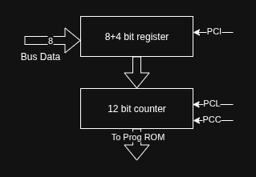

# Program Counter
The Program Counter helps set the address of the ROM to read instructions from it. A register is combined with the
counter to load a specific address value from the bus to perform jump operations.

## Block diagram

