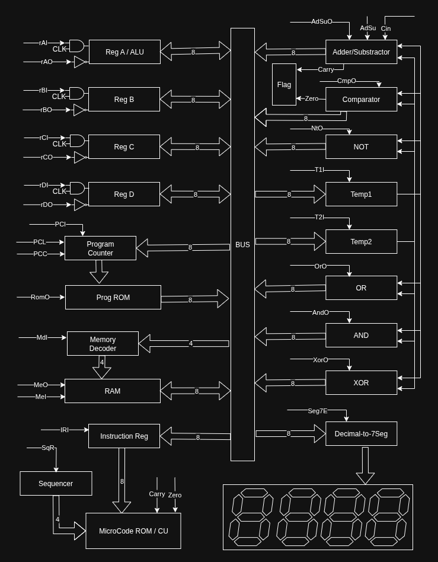

# 8-Bit Computer from Scratch (Built with Logic Gates)

Welcome to the documentation repository for my custom-built **8-bit computer**, constructed entirely from logic gates and basic components. This project is a deep dive into computer architecture, taking inspiration from classic microprocessors and educational systems, but designed from the ground up with a custom Instruction Set Architecture (ISA), control logic, and microcode.



## 🔧 Project Overview

This project is about understanding and constructing the fundamental building blocks of a computer:

- Registers and ALU
- Program Counter and Memory
- Instruction Decoder and Control Unit
- Microcoded Control Logic
- Arithmetic, Logic, and Comparison Units
- Bus-based Data Architecture
- Seven-Segment Display Output

## 🧠 Key Components

- **Registers A-D**: General-purpose 8-bit registers.
- **ALU**: Supports operations like ADD, SUB, AND, OR, XOR, NOT, CMP.
- **Program Counter**: Controls instruction flow with PCI, PCC, and PCE control signals.
- **RAM**: General memory with input/output controls (MeI, MeO).
- **Microcode ROM / Control Unit**: Controls signal sequencing for instruction execution.
- **Instruction Register**: Stores the current instruction fetched from memory.
- **Temp Registers**: Temporary internal storage for multi-step operations.
- **Flag Register**: Holds status flags (Zero, Carry).
- **7-Segment Display**: Used for displaying output values in decimal format.

## 📁 Repository Structure

```
.
├── Compiler/                        # Basic assembler for the custom ISA
├── GenMicroCode/                    # Microcode definitions and sequencing logic
├── Gen7segDriver/                   # 7 Segment display driver EEPROM logic
├── images/
│   └── top_level_architecture.png   # High-level block diagram of the computer
├── Datasheets/                      # Datasheets for different ICs
├── ISA.md                           # Details and documentation of supported instructions
└── README.md
```

## 🛠 Features

- Complete microcoded control unit for all supported instructions.
- Instruction decoder and sequencer implemented with logic.
- Custom ISA with binary opcode support.
- Support for logic-level debugging and test forcing.
- Graphical output via 7-segment display.


## 🧾 Instruction Set

Documentation about the supported instructions (ADD, SUB, AND, OR, MOV, JMP, etc.) is available in the **[`ISA.md`](Docs/ISA.md)** file.

Each instruction is defined with:
- Opcode
- Control signal sequences
- Clock cycles
- Examples


## 🛠 Control Signals
Documentation about all the control signal is available in the **[`SignalInfo.md`](Docs/SignalInfo.md)** file.


## 📸 Visuals

- Block Diagram: `Images/top_level_architecture.png`
- Future updates may include breadboard photos, logic analyzer screenshots, and waveforms.

## 🎯 Goals

- Learn computer architecture hands-on.
- Build a fully functional 8-bit computer using only logic gates.
- Design and implement a custom ISA.
- Optionally simulate with Logisim/Verilog for verification.

## 📬 Feedback & Contributions

This is a personal learning project, but contributions, discussions, and feedback are welcome! Feel free to open an issue or pull request if you'd like to contribute.

---

**Built with ❤️ from logic gates.**
